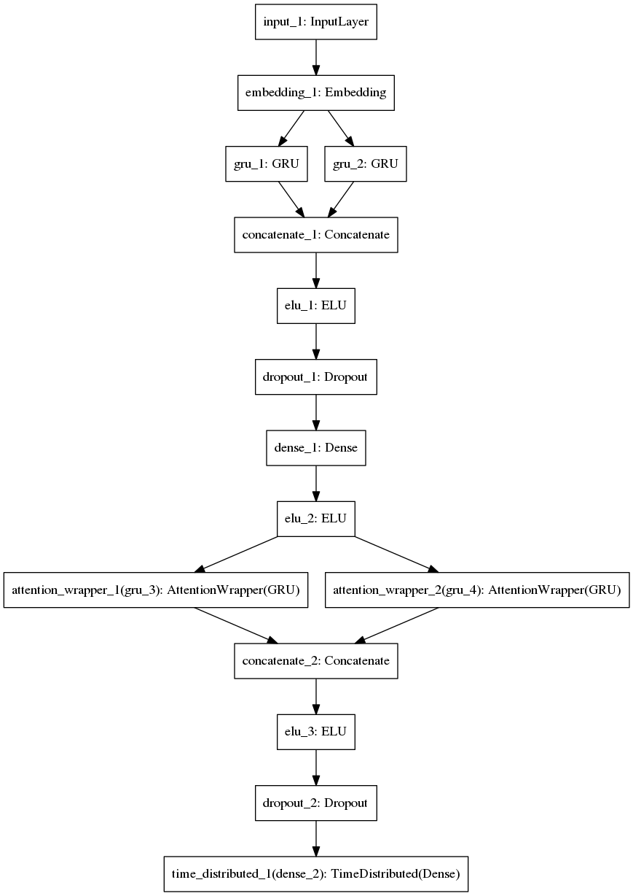

# Neural-Chatbot

A Neural Network based Chatbot

Inspired by "A Neural Conversational Model".

## Documentation

1. [Report 1](./reports/report-review-1.pdf)
2. [Report 2](./reports/report-review-2.pdf)
3. [Presentation](https://github.com/saurabhmathur96/presentations/blob/master/Mini-Project/review-1.pdf)

## Getting Started

1. Create virtualenv `virtualenv venv`
2. Install Dependencies `pip install -r requirements.txt`
3. Setup nltk and directories `python lib/setup.py`

## Data Preprocessing

0. Verify configurations in `configuration.cfg`
1. Fetch data `python src/data/opus11/pull.py`
2. Clean data `python src/data/opus11/make_pairs.py`
3. Prepare for training `python src/data/opus11/filter.py`

## Training

Train model `python src/model/train.py`

## Sampling & interface

Still working on this.

## Model Architecture

